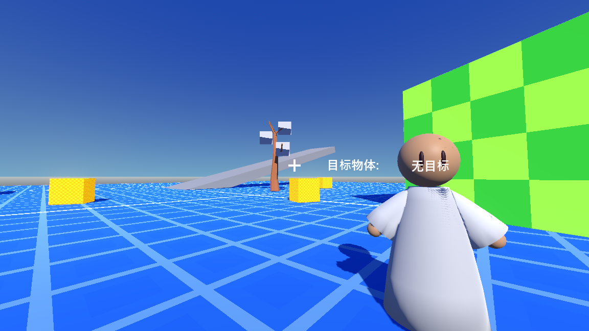

# My_3rd_personal_controller_demo_on_Godot

This is a 3rd personal controller test project

**Godor Engine version: Godot_v4.2.1-stable_win64**

WASD for walk;

Space for jump;

right mouse button for glaze;

Q for run;

Shift for sneak;

